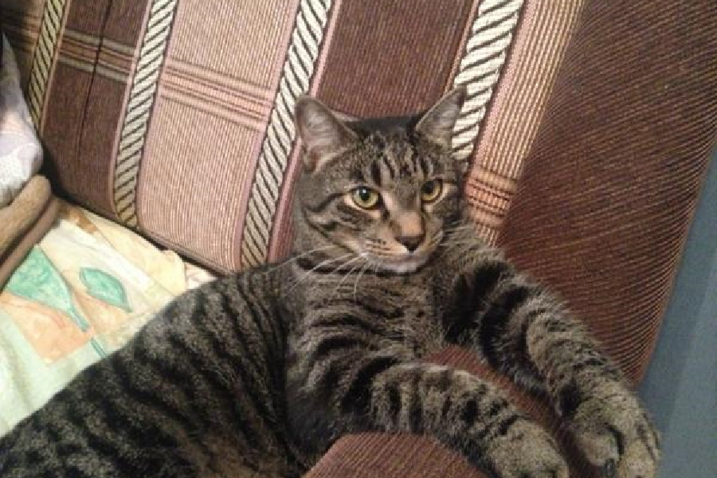

# Project template!

*Short description about the project, what it does, how, why, ...*

## Table of contents
- [Generalities](#generalities)
- [Setup](#setup)
  * [Assembly](#assembly)
  * [Code](#code)
- [Usage](#usage)
- [Troubleshooting](#troubleshooting)

## Generalities
*This is a template to create new projects for Game\*. It is to be used more as a guide than as a convention, so feel free to modify it as you please.*

*In this section, explain more in details what the project is and the commands. Maybe mention if a particular game should be used.*

*Feel free to do a little table as below to explain the commands!*

The mapping of the controls is done as follows:

| On the bike            | Player 1 | Player 2    | Effect        |
|------------------------|----------|-------------|---------------|
| Pedal                  | W        | Up arrow    | Accelerate    |
| Left handlebar button  | A        | Left arrow  | Turn left     |
| Right handlebar button | D        | Right arrow | Turn right    |
| (soon) Brakes          | S        | Down arrow  | Brake/Reverse |
| (soon) Special button  | Space    | Right Ctrl  | Use nitro     |

*If you want to add a note, use:*

> :information_source: **Note!** *Something that may be useful or helpful for the reader.*

*If you want to add a warning, use:*

> :warning: **Warning!** *Very import thing that the reader should take particularly care of.*

## Setup
Skip to [Usage](#usage) if you want to know how to use.

### Assembly
1) *Here, you should do a step-by-step guide on how to assemble the project from scratch.*

2) *Feel free to add a lot of details.*

> :information_source: **Note!** *And add notes for more details or insights.*

3) *Of course, when possible, add schemes and pictures.*

> :warning: **Warning!** *You may know what you are doing; the reader may not. Add more details!*

4) *Tables are particularly useful when dealing with electronics. Add the pinout!*

| Wire      | Goes on  |
|-----------|----------|
| VCC board | VCC line |
| GND board | GND line |

### Code
Please refer to the [main code README](./main/README.md).

*... Or put directly informations here, it depends on your project, really.*

## Usage
*Here you should write down everything that is to know for the player and the operator of the game, namely, once the project is ready to be used.*

*Particularly specify if a specific game shall be used.*

*If an operator is needed, add the following:*

> :information_source: **Note!** This setup requires an operator to handle the menu.

1) *Here, you should do a step-by-step guide on how to play the project.*

2) *Feel free to add a lot of details.*

> :information_source: **Note!** *And add notes for more details or insights.*

3) *Of course, when possible, add pictures and screenshots.*

> :warning: **Warning!** *You may know what you are doing; the reader may not. Add more details!*

## Troubleshooting
*Here is the time to add instructions on how to fix problems with the project that cannot get fixed by maintainers.*

*Basically if something can get broken and cannot get easily fix, add ways to bypass the problem, fix it temporarly, etc.*
